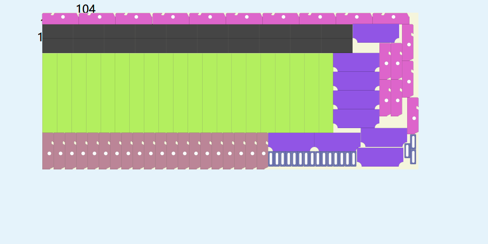
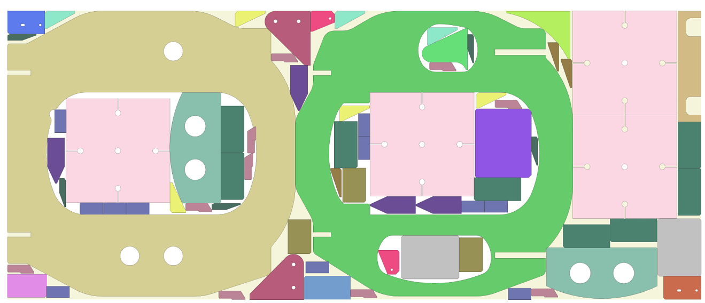
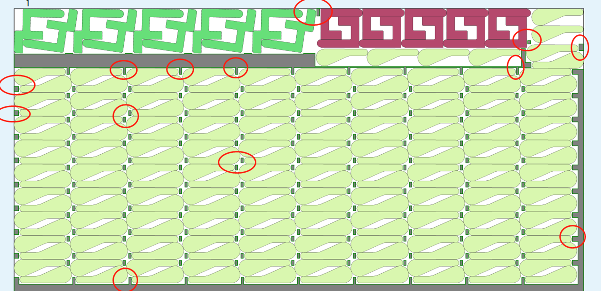
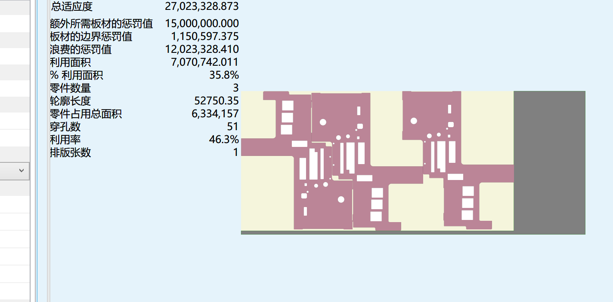
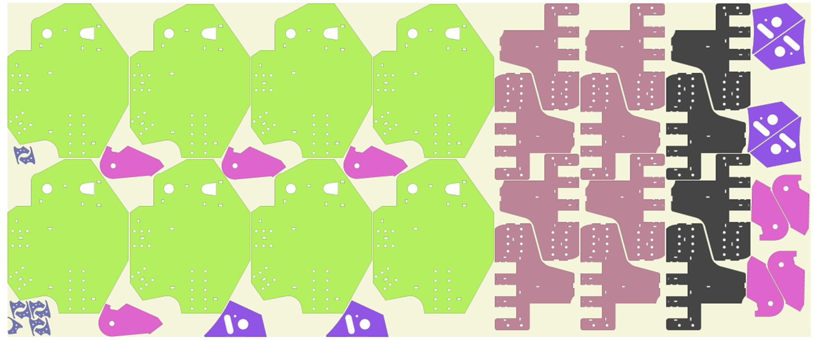

# 在前公司的一些工作记录

## 1.排版

 - 第一版，在开源项目[DeepNestSharp](https://github.com/9swampy/DeepNestSharp)的基础上进行二开，使用遗传算法进行排版。随机生成零件旋转角度，使用clipper计算finalNfp。尝试保存中间过程，但是结果不够理想。排版不可复制，在零件数量、种类较多的情况，排版速度十分慢。
  
 - 加入数学规划(线性规划), 使用Google的OR-Tools库进行排版。排版速度极快，主要针对矩形零件和类似矩形零件(最小外接矩形面积与其面积差值在给定范围内)以及圆形零件。
  
 - selfCombine,通过二分法计算各个角度下零件自身组合的民可夫斯基和(Minkowski Sum),得到最小值。
  
   - Pattern Repeat就是在板材上进行重复排版，使用clipper计算finalNfp。在数学规划排版的基础上，根据当前的finalNfp找到一条切线得到每一个垂直方向上第一个零件的位置后利用零件的左下角的坐标点和这个位置计算偏移量，再将零件剩下的点偏移到正确的位置，沿着这条切线将零件在垂直方向上进行复制，以此实现将合并之后的零件或者单个零件在垂直方向上进行复制摆放。
    
 - 整合数学规划和Pattern Repeat(协助同事一起完成), 我写的Pattern Repeat解决了排版之间的缝隙大的情况。
   - 同事得到的排版
     
   - 优化后的
   
 - 利用零件孔洞,零件存在孔洞且其面积较大时，排版利用率会比较低。我们把零件孔洞当成板材，计算得到finalNfp，填充孔洞。
  
  
  
  
  
## 2.报价
 - 重构套料方法，使得报价接口可以对接
 - 调整选板方式，根据剩余最大零件找合适的板材
 - 计算利用率等数据，提供给平台，用于计算价格
 - 图片展示
  
## 3.派单
 - 实际业务中进行板材推荐时要经客户的订单按照材质，板厚和切割方式进行分组之后再对应每一个分组进行合适的板材，利用python语言书写脚本，针对每一个分组，找到和当前的材质板厚一样的板材然后计算板材的长宽和重量信息查看是否符合这个分组中的零件的要求，满足的话就可以输出当前的板材，对于需要多块板材的情况要计算每块板材的满足率，不满足的话就不进行推荐，同时这也提示库存中没有合适的板材需要新购。
   
## 4.优化排版效果
- Pattern Repeat结果不够整齐，调整filterFinalNfp
- 在实际应用中有些零件特别是带弧形轮廓的零件，当这种零件排下之后生成的finalNfp不够整齐，这样就导致找不到一条比较光滑的切线同时也会造成排版速度非常慢，所以通过filterFinalNfp函数，将finalNfp中的点进行滤波，使得finalNfp的点更加光滑，同时也可以减少finalNfp的点的数量，提高排版速度
   
  
- 内接改外接，去掉微小的重叠-为了更快更好的展示结果，弧形的点进行了滤波利用弧形的内切点描绘这个图形，但是会造成一些微小的重叠，所以通过将内接轮廓变成外接轮廓，去掉重叠，提高排版速度
  
- 优化截余料算法
  
  
  
## 5.遇到的麻烦
 - 重叠-零件与零件之间出现覆盖，这种排版是无法使用的
  
  引起重叠的很大一部分原因是解析之后的零件没有明确长边事零件的长度还是x轴方向的长度，所以在进行pattern repeat的时候会出现这种情况
  通过对这种情况的处理就是将重叠的零件进行分开，然后再进行排版，这样就可以避免零件之间的重叠
  
 - 零件排版不紧密-零件之间的间隙过大，排版不紧密
  
  
  针对这种情况的处理就是通过将第三个零件旋转180度，然后再进行排版，这样就可以使得零件之间的间隙变小，排版更加紧密，能排多一个零件
 - 零件排列不美观
  
  
  
  像这种排版就是因为有多段切线造成的，这个时候就要针对切线进行分批摆放就可以让这个排版更加合理
 - 对零件的形状判断出错-零件整体上会被分成规范形状（矩形，圆形）和不规范形状（多边形，带弧形轮廓的零件）
  
  类似这种零件的点非常多，整体上是可以判断这个零件是一个圆形的，但是由于判断出错会导致排列不合理，通过对这个零件的外轮廓的凸包套件可以将这个零件规划到圆形零件里
## 6.排版效果展示
  
  
  
  
  
  
  
  
  
  
  
  
  
  
  
  
  
  
